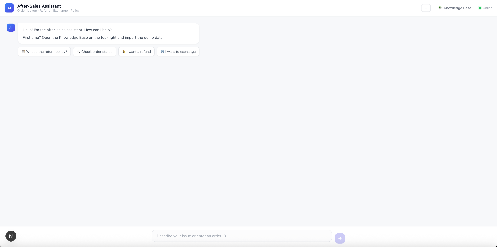

# After-Sales Assistant（售后助手）

**语言：** [English](./README.md) | 简体中文

基于 LangGraph 框架构建、部署在 EdgeOne Makers 上的 AI 售后客服 Agent，支持订单管理、知识库检索与交互式卡片。

**Framework:** LangGraph · **Category:** Chat · **Language:** TypeScript

[](https://console.cloud.tencent.com/edgeone/makers/new?template=after-sales-assistant&from=within&fromAgent=1&agentLang=typescript)

<!-- TODO: confirm -->


## Overview

本模板提供端到端的售后助手能力，通过对话界面处理退款、换货、订单查询与 FAQ。LangGraph 状态机将用户意图路由到专用处理节点，在多轮对话中持久化订单状态，并为订单详情与退款进度渲染富交互卡片。

- **基于意图的路由** — LangGraph 条件边自动将请求分类为 FAQ 搜索、订单查询、退款、换货或通用聊天。
- **订单生命周期管理** — 查询订单状态、处理退款与换货申请，全部状态通过内置存储持久化。
- **知识库检索** — 将文档上传至多分类 Blob 存储；Agent 检索相关段落以回答售后政策问题。
- **交互式 UI 卡片** — Agent 发出结构化卡片事件（订单详情、退款进度、换货确认、FAQ 来源），前端直接内联渲染。
- **多轮上下文保持** — 对话状态与订单上下文通过 `langgraphStore` 跨轮次保留，支持“我另一个订单呢？”这类追问。

## Environment Variables

| 变量 | 必填 | 说明 |
|----------|----------|-------------|
| `AI_GATEWAY_API_KEY` | 是 | 模型网关 API Key。使用 Makers Models 的 API Key，或任何兼容 OpenAI 协议的提供商 Key。 |
| `AI_GATEWAY_BASE_URL` | 是 | 网关基础地址。使用 Makers Models 时填写 `https://ai-gateway.edgeone.link/v1`。 |
| `PROJECT_ID` | 否 | Pages 项目 ID，用于 Blob 存储（知识库文档）。 |
| `EDGEONE_PAGES_API_TOKEN` | 否 | Blob 存储的 API Token。 |

本模板遵循 OpenAI 兼容标准 —— 可指向 Makers Models 或任何兼容提供商。

### 如何获取 AI_GATEWAY_API_KEY

1. 打开 Makers 控制台（https://console.cloud.tencent.com/edgeone/makers）
2. 登录并启用 Makers
3. 进入 Makers → Models → API Key，创建 Key
4. 将其填入 `AI_GATEWAY_API_KEY`

> 内置模型在额度内免费，适合验证；生产环境请绑定自费厂商 Key（BYOK）。

## 本地开发

**前置依赖**
- Node.js 18+
- EdgeOne CLI（`npm i -g @edgeone/cli`）

```bash
npm install
# 本项目已包含 .env 文件，请直接更新其中的 AI_GATEWAY_API_KEY 与 AI_GATEWAY_BASE_URL
edgeone makers dev
```

本地可观测面板地址：http://localhost:8080/agent-metrics。

## 项目结构

```
after-sales-assistant-edgeone/
├── agents/
│   ├── _shared.ts          # 模型初始化、SSE 辅助函数、订单类型与持久化
│   ├── _data/              # 模拟订单数据与演示文档
│   ├── _graph/
│   │   ├── builder.ts      # LangGraph 状态机编译
│   │   ├── edges.ts        # 意图路由逻辑
│   │   ├── nodes.ts        # 节点实现（意图、FAQ、订单、退款、换货）
│   │   └── state.ts        # 图状态结构
│   ├── chat/               # POST /chat —— 主 SSE 对话处理器
│   └── stop/               # POST /stop —— 中止运行
├── cloud-functions/
│   ├── health/             # GET /health
│   ├── manage/             # POST /manage —— 文档增删改查
│   ├── seed-demo/          # POST /seed-demo —— 批量导入演示文档
│   └── upload/             # POST /upload —— 文件或文本上传
├── app/                    # Next.js App Router 前端
├── lib/
│   ├── doc-store.ts        # 多分类 Blob 文档存储
│   └── parser.ts           # 文件解析器（PDF/DOCX/XLSX/TXT/MD）
└── edgeone.json            # EdgeOne 部署配置
```

以 `_` 为前缀的文件是私有模块，不会作为公共路由暴露。

## 工作原理

### 运行模式
`agents/` 下的文件以**会话模式**运行：相同 `conversation_id` 的请求会被粘性路由到同一 Agent 实例。这意味着多轮对话自动共享同一份内存上下文。

### 端到端流程

1. **请求入口** —— 前端向 `/chat` POST `{ message, pendingAction }`。
2. **意图识别** —— LangGraph 的 `intent_recognition` 节点将用户消息分类为：`faq_search`、`lookup_order`、`request_refund`、`request_exchange` 或 `general_chat`。
3. **条件路由** —— `routeByIntent` 边将请求分发到对应节点。
4. **工具 / 存储执行** —
   - `lookup_order` 查询 `langgraphStore` 获取订单并发出 `order_detail` 卡片。
   - `faq_search` 从 Blob 存储检索文档并生成带来源引用的答案。
   - `request_refund` / `request_exchange` 校验订单状态、更新状态并发出进度卡片。
5. **状态持久化** —— 每轮结束后，图状态（当前订单、意图、等待标记）以 `conversation_id` 为键写回 `langgraphStore`。
6. **SSE 响应** —— 处理器向前端流式推送工作流步骤、AI 文本、卡片事件与智能跟进建议。
7. **中止** —— 向 `/stop` POST 对话 ID，调用 `context.utils.abortActiveRun` 取消正在进行的生成。

### 关键路由与参数
- `/chat` —— 主对话端点。接收 `message` 与可选的 `pendingAction`。
- `/stop` —— 取消某对话的活跃运行。
- `conversation_id` 由运行时通过 `context.conversation_id` 自动提供。

### 运行参数
- `agents.timeout`：900 秒
- `agents.sandbox.timeout`：900 秒

## 相关资源

- [Makers Agents 文档](https://edgeone.ai/makers)
- [Makers 快速开始](https://edgeone.ai/makers/docs/quickstart)
- [Makers Models](https://console.cloud.tencent.com/edgeone/makers/models)

## 许可证

MIT
